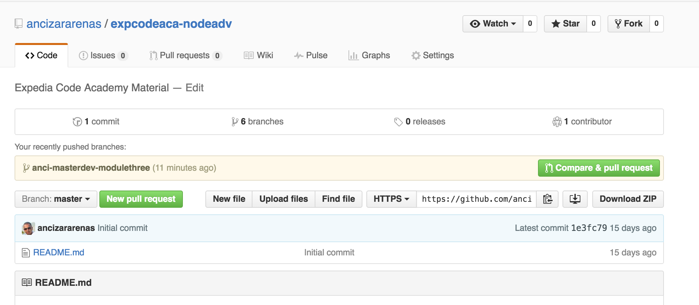
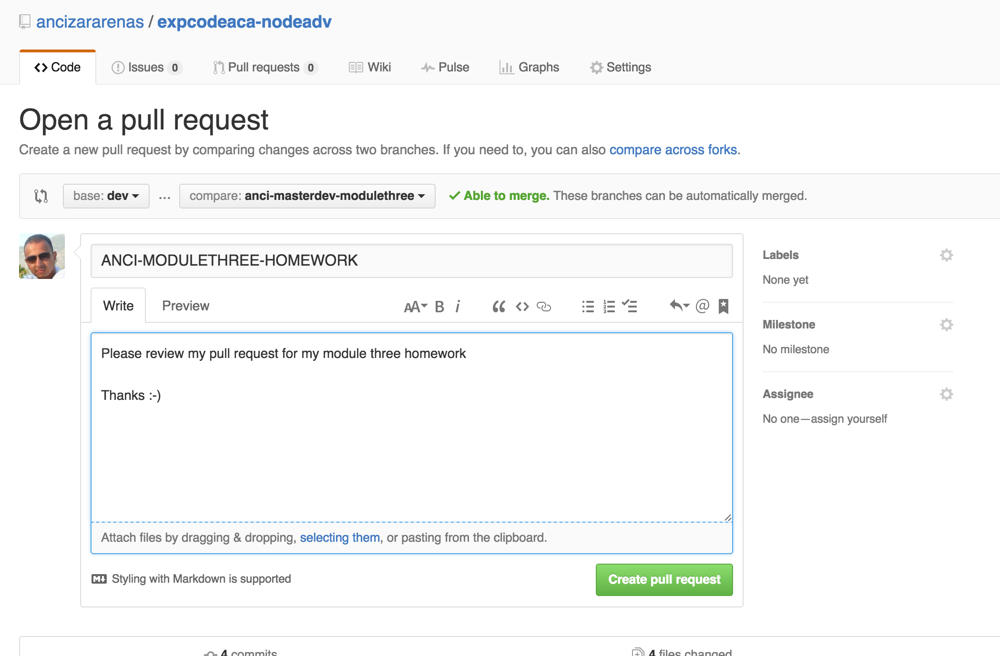

# MODULE 4 - TASK BREAKDOWN

Last week you were set four tasks in which you were to use the middleware logger
we created throughout our api. We also improved our api by only allowing the server to
start once a successful connection to the database was achieved.

You were also set homework in which you were to use the knowledge and techniques gained
and attempt to extract the routes from the app.js file, and inject them to Express in order
to begin to modularise our api.

This week, we will be looking to take this a step further. We will now begin to define our REST product api
routes and make sure that they are responding correctly.

### TASK ONE - 15 mins

For this task, you will need to create the following routes and create responses for each. Each endpoint must be working
and you must use our logging middleware to make sure we are logging adequately.

|method   | endpoint                               | description                   |
| ------- | -------------------------------------- | ----------------------------- |
| GET     | /products                              | get all products available    |
| GET     | /products/{id}                         | get product with specified id |
| POST    | /products                              | create product                |
| PUT     | /products/{id}                         | update product                |
| DELETE  | /products/{id}                         | delete product                |

### TASK TWO - 30 mins

Now that we have our routes configured we want to now begin to add logic to our api to handle our routes.
Before we can retrieve a product, we will first need to create one.

1. Refactor the routes further by creating a resources directory and extracting our product logic and creating an index file within the resources directory.
   Make sure you are still able to make requests to the api and once refactored that everything works as expected.

### HOMEWORK EXPLANATION

Due Data : 16/05/16 18:00 Latest please so that I may have sufficient time to review

In continuation to our work to date, we now want to begin extracting our logic within our routes. Your homework is to continue the work from class and get to a point where you have extracted the domain logic from the routes and extracted into a file within the resources directory previously created.

Each of you must create a pull request against the dev branch by saving your changes and adding all of your files to the git VCS by using the following commands :

    git add .   // add and mark all modified/newly created files to be be tracked by git

    git status    // make sure all your modifications made are present

    git checkout -b <yourname>-modulefour origin/dev   // this will pull all your local changes to your new feature branch    

    git commit -a -m "<yourname> - <commit message goes here>"    // should see something like  3 files changed, 56 insertions(+), 11 deletions(-)

    git push origin <your branch name> e.g : git push origin anci-modulefour   // should see something like  * [new branch]      anci-modulefour -> anci-modulefour

go to https://github.com/ancizararenas/expcodeaca-nodeadv

you should see your branch in the recently pushed branches section. Click on "Compare & Pull Request" button like below :

update your pull request details using the below guide as an example and create your pull request for reviewing

Thats it folks!! See you next session
